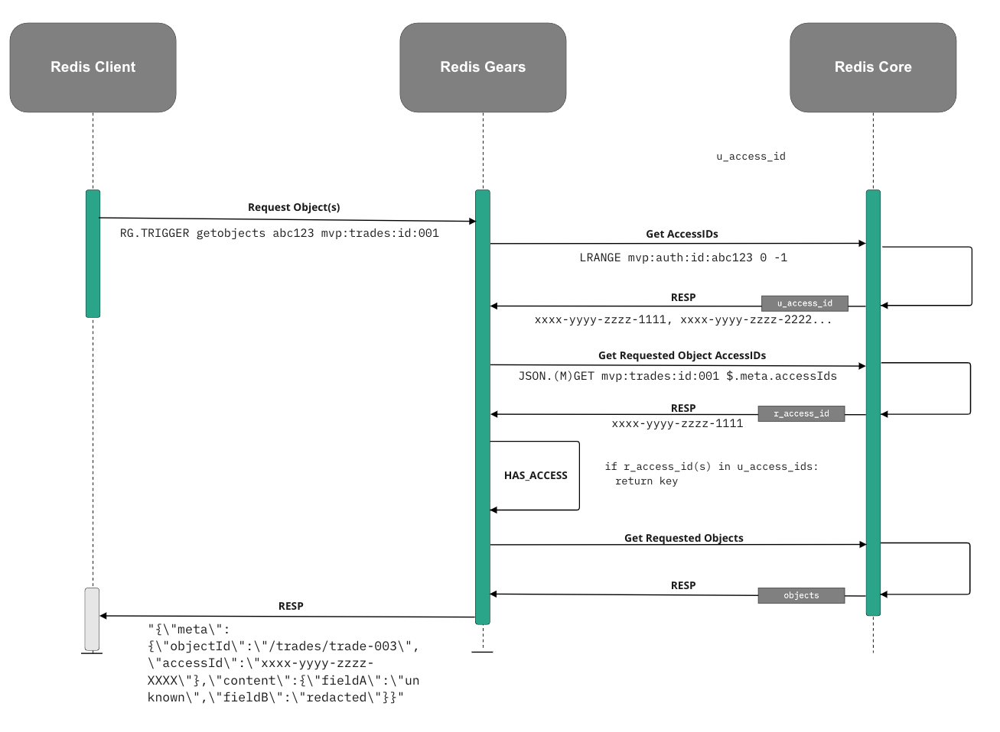

# Preparation

see https://github.com/RedisGears/gears-cli
```
pip install gears-cli

# make sure to have Gears 1.2+
docker pull redislabs/redismod:latest

# Note we switch to port 30001 to keep same port as for below cluster setup
docker run -p 6379:6379 redislabs/redismod:latest
```

# Scenario

The purpose of the implementation is to test 'API based' authorisation of Redis Objects
- We will be using JSON objects stored using the RedisJSON module 
- We will be using ACLs to retrict the user to the created Redis Gears API calls 
- Rather than implement a full User -> Group(s) <- AccessIds structure, we are simply returning accessible `access_ids` for a given token_id/user_id 
- This provides key based authorisation, something not currently possible using ACLs   

This scenario looks to implement the `JSON.GET` and `JSON.MGET` commands and only return those json objects which the given token_is/user_id has access to. 


# Implementation 

Implemented API calls: 
- `getobjects`
- `setobjects`

> **_NOTE:_**  `setobjects` does not enforce any kind of authorisation logic

### Arguments 

`<gears-api-name> <token_id> <keys[]> <obj_ref(optional)>`
- `gears-api-name` : name of the implemented gears API 
- `token_id` : token_id/user_id used to obtain the corresponding `access_id`. 
- `keys` : An array of Redis (JSON) keys in which to access 
- `obj_ref` : nested part of the object to return. Leave blank to return the whole object. 

e.g. `RG.TRIGGER <gears-api-name> <token_id> <keys[]> <obj_ref(optional)>`

### Example Calls 

#### Get JSON Object (eligible)
   
   **Request**: 
   
   `RG.TRIGGER getobjects abc123 mvp:trades:id:001`
    
   **Response**: 
   
     ```
     1) "[{\"meta\":{\"objectId\":\"/trades/trade-001\",\"accessId\":\"xxxx-yyyy-zzzz-1111\"},\"content\":{\"fieldA\":\"hello-world\",\"fieldB\":\"goodbye-world\"}}]"
    ```

#### Get JSON Object (not eligible)

   **Request**: 
   
   `RG.TRIGGER getobjects abc123 mvp:trades:id:003`
    
   **Response**: 
   
     ``` 
     1) "No access to requested keys"
     ```

#### Get Multiple JSON Object (eligible)
   
   **Request**: 
   
   `RG.TRIGGER getobjects abc123 mvp:trades:id:001 mvp:trades:id:002`
    
   **Response**: 
   
     ``` 
     1) "['[{\"meta\":{\"objectId\":\"/trades/trade-001\",\"accessId\":\"xxxx-yyyy-zzzz-1111\"},\"content\":{\"fieldA\":\"hello-world\",\"fieldB\":\"goodbye-world\"}}]', '[{\"meta\":{\"objectId\":\"/trades/trade-002\",\"accessId\":\"xxxx-yyyy-zzzz-3333\"},\"content\":{\"fieldA\":\"testing\",\"fieldB\":\"testing\"}}]']" 
     ```


#### Get Multiple JSON Object (partial-eligible)

   **Request**: 
   
   `RG.TRIGGER getobjects abc123 mvp:trades:id:001 mvp:trades:id:002 mvp:trades:id:003`
    

   > **_NOTE:_**  not eligible to access `mvp:trades:id:002`

   **Response**: 

        ``` 
     1) "['[{\"meta\":{\"objectId\":\"/trades/trade-001\",\"accessId\":\"xxxx-yyyy-zzzz-1111\"},\"content\":{\"fieldA\":\"hello-world\",\"fieldB\":\"goodbye-world\"}}]', '[{\"meta\":{\"objectId\":\"/trades/trade-002\",\"accessId\":\"xxxx-yyyy-zzzz-3333\"},\"content\":{\"fieldA\":\"testing\",\"fieldB\":\"testing\"}}]']" 
     ```

> **_NOTE:_**  response returns only eligible keys 

\


> **_NOTE:_**  the implementation could be more efficient by calling all the objects and iterating over them rather than obtaining their accessIds first, then filtering on keys. 


# Run the demo

This demo uses very simple test data: 

The relationship between token_id/user_id is stored as a simple list of Key/Values:  
- mvp:auth:id:abc123 : xxxx-yyyy-zzzz-1111
- mvp:auth:id:abc123 : xxxx-yyyy-zzzz-2222
- mvp:auth:id:abc123 : xxxx-yyyy-zzzz-3333

Our data utilises a very simple JSON object mode: 

```json
{   "meta": 
        {   
            "accessId":"XXXX",
            ... 
        }, 
    "content": { ... }
}'
```

1. Run the redismod docker container 
> **_NOTE:_**  redismod has the RedisGears module pre-installed

2. Run ACL command below:
   - This will create a user named `test` with a passwd `test` and the only commands on Redis they can execute are the RedisGears API commands we have created. 

        `acl setuser test on >test +rg.trigger|setobjects +rg.trigger|getobjects` 

3. Seed Redis with the test data 

    `cat data.txt | redis-cli -x`

4. Register the RedisGears implementation

    `cat mvp-auth.py | redis-cli -x -c RG.PYEXECUTE`

5. Login to Redis as the `test` user

    `redis-cli --user test -a 'test'`

6. Test the Gears Implementation e.g. 

    ```
    127.0.0.1:6379> RG.TRIGGER getobjects abc123 mvp:trades:id:001 mvp:trades:id:002 $.meta.accessId

    1) "['[\"xxxx-yyyy-zzzz-1111\"]', '[\"xxxx-yyyy-zzzz-3333\"]']"```

# Todos

1. Test Against a sharded database

# Docs

Redis Gears
https://oss.redis.com/redisgears/

Redis JSON
https://redis.io/docs/stack/json/

RedisGears - Command Reader 
https://oss.redis.com/redisgears/readers.html#commandreader


